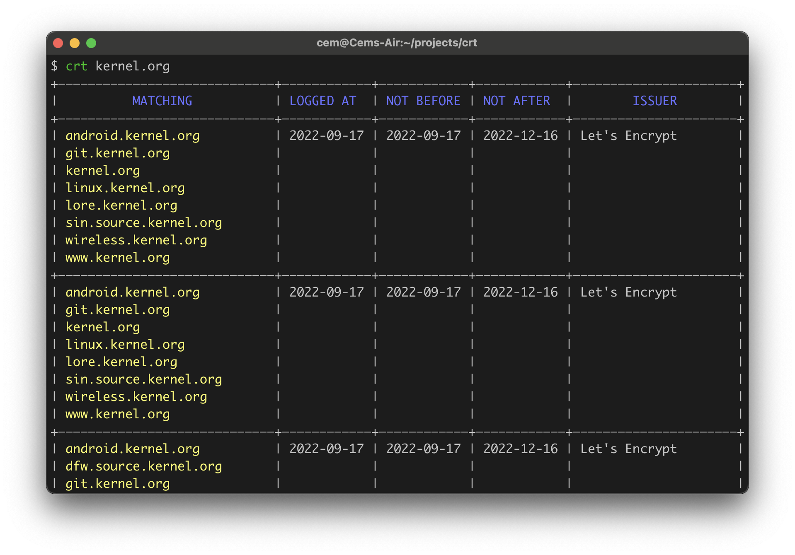
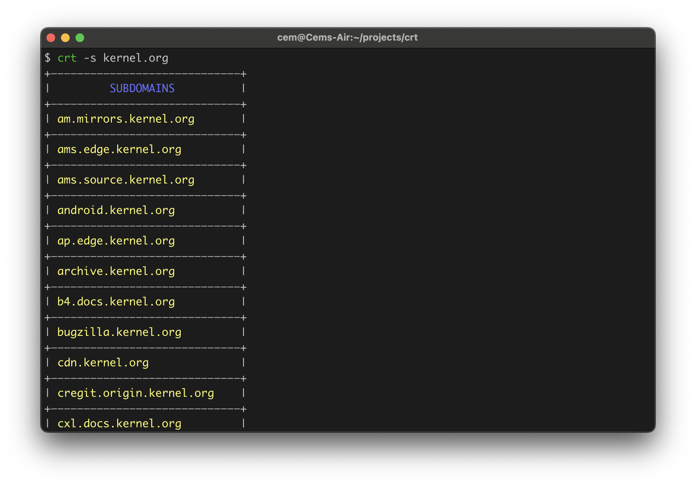

# crt

**crt** is a CLI tool to check [Certificate Transparency](https://en.wikipedia.org/wiki/Certificate_Transparency) logs of a domain name.
It can also enumerate subdomains.

## Installation

### From binary

Check the [release page](https://github.com/cemulus/crt/releases/latest) for the executables.

### From source

If you have Go installed:

```bash
go install github.com/cemulus/crt@latest
```

## Usage

```bash
Usage: crt [options...] <domain name>

Options:
  -s        Enumerate subdomains.
  -e        Exclude expired certificates.
  -l <int>  Limit the number of results. (default: 1000)
  -o <path> Output file path. Write to file instead of stdout.
  -json     Turn results to JSON.
  -csv      Turn results to CSV.

Examples:
  crt example.com
  crt -s -e example.com
  crt -csv -o logs.csv -l 15 example.com
  crt -json -o logs.json example.com
```

## Examples





## License

[Apache License 2.0](https://choosealicense.com/licenses/apache-2.0/)
